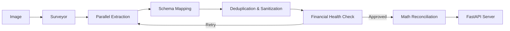

# Invoice Extractor (PharmaCouncil) 🏥

> **An Agentic Swarm Architecture for High-Precision Pharmaceutical Invoice Processing**

The **Invoice Extractor** is a specialized document intelligence system designed to solve the "Last Mile" problem in extracting complex, noisy, and mathematically inconsistent pharmaceutical invoices. Unlike standard OCR tools that merely read text, this system **understands** the financial logic of the invoice, employing a **Self-Correcting Feedback Loop** to reconcile extracted line items against the stated grand total with perfect mathematical precision.

---

## 🚀 Key Features

*   **Logic-Aware Extraction**: The system doesn't just read; it calculates. If the extracted line items don't sum up to the Grand Total, it investigates why (Discount? Tax? Freight?) and fixes it.
*   **"Perfect Match" Reconciliation**: A robust normalization engine that detects "Inflation" (Double Tax) or "Deflation" (Missing Discount) and applies specific mathematical corrections to force the data to align with the immutable Anchor (The Stated Total).
*   **Swarm Architecture**: Uses a graph of specialized AI agents:
    *   **Surveyor**: Maps the document layout.
    *   **Worker**: Extracts raw data from parallel zones.
    *   **Auditor**: Dedupes and cleans data.
    *   **Critic**: Validates financials and triggers retries.
    *   **Solver**: Reconciles the final math.
*   **Inventory Graph**: Persists extracted data (Batch, Expiry, MRP, Landed Cost) into a Neo4j Graph Database for detailed inventory tracking.

---

## 🏗️ Architecture

The system is built on **LangGraph**, orchestrating a Directed Acyclic Graph (DAG) of agents.



### The "Perfect Match" Engine
The core innovation is the `reconcile_financials` module in `src/normalization.py`. It solves the common OCR problem where individual lines don't add up to the total:
1.  **Calculate Gap**: `Sum(Lines) - Grand_Total`
2.  **Identify Direction**: Is the sum too high (Inflation) or too low (Deflation)?
3.  **Apply Correction**:
    *   If **Inflated**, it looks for *Discounts* to reduce the value.
    *   If **Deflated**, it looks for *Taxes/Freight* to increase the value.
    *   It applies the **Exact Gap** as a correction factor, ensuring `Sum == Total`.

---

## 🛠️ Setup & Installation

### Prerequisites
*   Python 3.10+
*   Node.js & npm (for Frontend)
*   Neo4j Database (Local or Aura)
*   Google Gemini API Key

### 1. Environment Variables
Create a `.env` file in the root directory:
```bash
GOOGLE_API_KEY=your_gemini_key
NEO4J_URI=bolt://localhost:7687
NEO4J_USER=neo4j
NEO4J_PASSWORD=your_password
```

### 2. Backend Setup
```bash
# Create Virtual Environment
python3 -m venv .venv
source .venv/bin/activate

# Install Dependencies
pip install -r requirements.txt
```

### 3. Frontend Setup
```bash
cd frontend
npm install
```

---

## 🏃‍♂️ Usage

### Start the System
You need to run both the Backend (API) and Frontend (UI).

**Terminal 1: Backend**
```bash
source .venv/bin/activate
uvicorn src.api.server:app --reload
```
*API Docs: http://localhost:8000/docs*

**Terminal 2: Frontend**
```bash
cd frontend
npm run dev
```
*UI: http://localhost:5173*

---

## 📂 Project Structure

```
.
├── src/
│   ├── workflow/          # LangGraph Agent Nodes (Worker, Critic, etc.)
│   ├── extraction/        # Base Extraction Logic
│   ├── services/          # Neo4j & Vector Store Services
│   ├── api/               # FastAPI Endpoints
│   └── normalization.py   # Core Math & Reconciliation Logic
├── frontend/              # React + Tailwind Source Code
├── tests/                 # Unit & Integration Tests
└── data/                  # Local Data (Ignored by Git)
```

## 📄 License
Proprietary.
